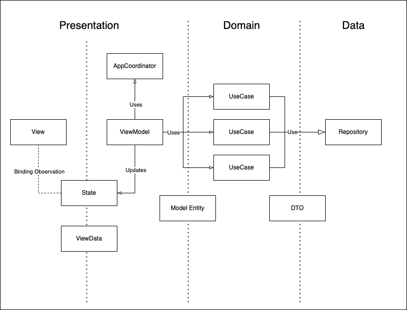
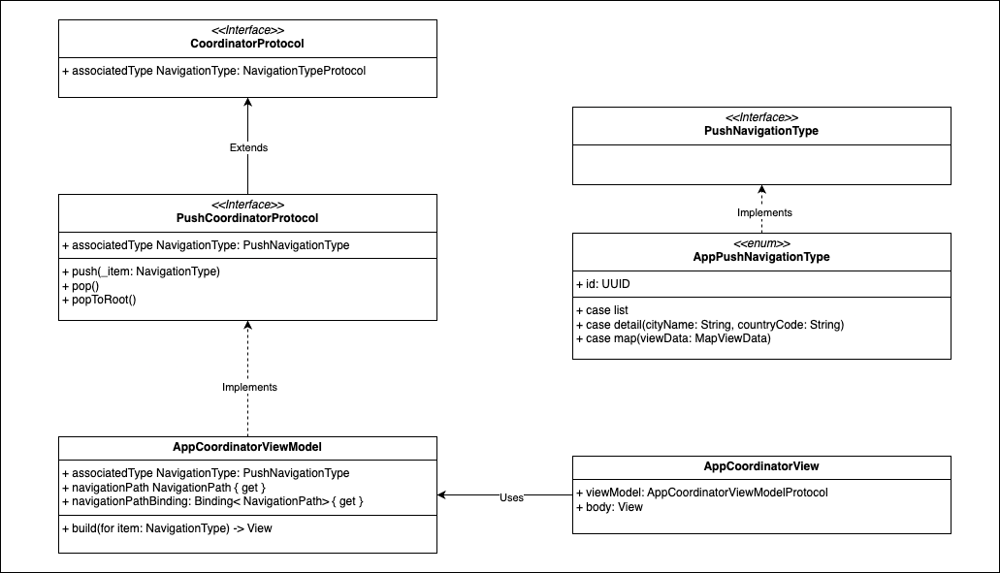

# Cities - Ualá Mobile Challenge (iOS)

This is an iOS solution to the Ualá Mobile Challenge, implemented in **Swift** using **SwiftUI**, **SwiftData**, **Clean Architecture** and SOLID principles.

---

## 📷 Screnshoots


## 🧱 Architecture

The app follows a layered Clean Architecture design with MVVM for the Presentation layer.
Each layer is isolated and communicates only through protocols, which enables testability and clear separation of concerns.

### Architecture Overview

```
[ Presentation Layer (SwiftUI Views + ViewModels (MVVM)) ]
        ⇅
[ Domain Layer (UseCases + Entities + Protocols) ]
        ⇅
[ Data Layer (Repositories + DTOs + Networking + SwiftData Storage) ]
```

### Architecture Design


### Coordinator Pattern


### Design Choices

- **Clean Architecture** separates the app by responsibility, enabling scalable and testable code.
- **MVVM + SwiftUI** for modern declarative UI binding.
- **Protocol-Oriented Programming** enables mocking and swapping implementations easily.
- **Manual Dependency Injection** via `AppContainer`.
- **SwiftData** persists favorite cities between launches.
- **NetworkingClient** abstracts URLSession and is injected into repositories.

---

## 📁 Folder Structure

```
Cities/
├── App/                                # App entry point
│   └── DependencyInjection/            # DI
│       └── AppContainer.swift
│   └── Navigation/                     # Coordinator Pattern
│       └── AppCoordinatorView.swift
│       └── AppCoordinatorViewModelProtocol.swift
│       └── AppCoordinatorViewModel.swift
│       └── AppPushNavigationType.swift
│   └── Resources/                      # Assets


├── Presentation/                       # SwiftUI Views + ViewModels + ViewDatas
│   ├── CityList/
│   │   ├── Views/
│   │   ├── ViewModels/
│   │   ├── ViewDatas/
│   ├── CityDetail/
│   │   ├── Views/
│   │   ├── ViewModels/
│   │   ├── ViewDatas/
│   └── Map
│   │   ├── Views/
│   │   ├── ViewModels/
│   │   ├── ViewDatas/
│   └── About

├── Domain/                             # Business logic & interfaces
│   ├── Entities/
│   ├── UseCases/
│   ├── Mappers/

├── Data/                               # Implementations, persistence & parsing
│   ├── Repositories/
│   ├── Networking/
│   ├── DTOs/
│   └── Storage/                        # Local Persistance
│       └── SwiftData/
│           └── Models/

├── Resources/                          
├── CitiesTests/                        # Unit tests
├── CitiesUITests/                      # UI tests

└── README.md
```

---

## 💡 Dependency Injection

- `AppContainer` is the composition root and builds all dependencies.
- Initialises and injects all dependencies incluiding Repositories and UseCases.
- `AppContainer` mantains the AppCoordinator and ModelContext for local persistance.
- ViewModels are injected into views at the root level.

---

## 🧪 Testing

- **Unit tests** validate search correctness and data logic
- **UI tests** ensure filtering, favorites, and navigation behave correctly

---

## 🔧 Project Build Requirements

- Xcode 16+
- iOS 18+

---

## 🗂 Assumptions & Decisions

- Favorite status is persisted only by `cityId`
- City details screen includes information fetched from Wikipedia API
- Map feature uses native MapKit integration

---

## 🔍 Filter Algorithm (Using Trie)

To efficiently filter a large number of city names by prefix, we implement a Trie data structure.
True lets us perform prefix search in linear time with respect to the length of the prefix, instead of having to iterate through all 200,000+ city names each time.

### 🌲 What is a Trie?

A trie is a specialized tree-shaped data structure designed for fast retrieval of strings by their prefix.
Each node in the trie corresponds to a single character in a string.
Paths from the root to a node form a prefix.
For example, for the city “Salta”, the path s → a → l → t → a traces its spelling.

## Algorithm Explained

### Construction (Insert):
We insert each city’s name into the trie char by char.

For each character in the city’s name:
- If a child node for that char doesn’t exist, we create it.
- We move into that child and append the city to its cities array. This lets us quickly retrieve all matching cities for a given prefix later.

### Search (Retrieve):
To find all cities matching a prefix:
- We start from the root and follow children matching each character in the prefix.
- If we successfully match all prefix letters, we return the cities array at that node.

## City Detail Service
In order to get more informationa about cities the app uses Wikipedia API: https://en.wikipedia.org/api/rest_v1. The app uses the endpoint https://en.wikipedia.org/api/rest_v1/page/summary/{cityName} to fetch the data related to a given city name.
For some cities the API finds a valid data but the result is ambiguous (ex: New York, is a city and also a state of USA). In that the app display the following error:


The app shows the same error when a city has a valid result from the service but does not match with the city. (ex: Buenos Aires, CO. The result is correct for the country code AR but not for CO)
## 📬 Contact

For any questions related to the implementation, feel free to reach out to giampietri.gonzalo@gmail.com
